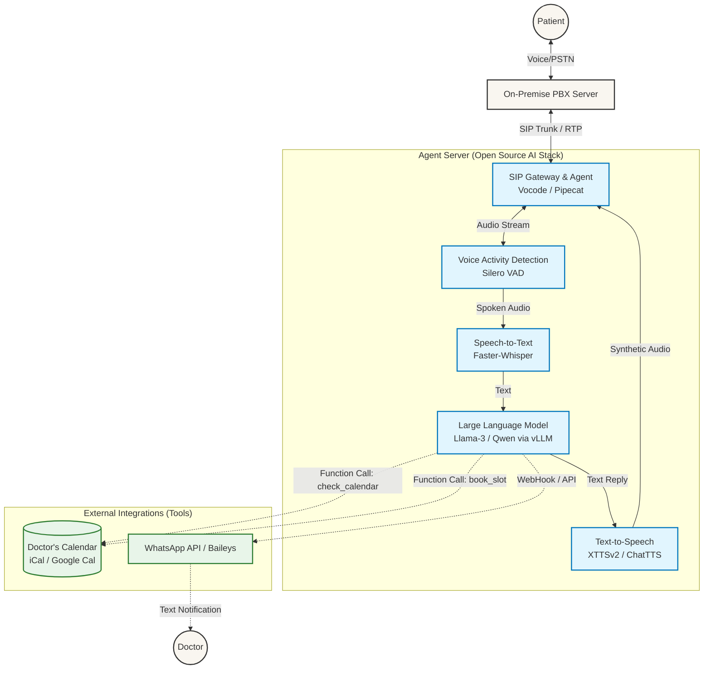

# AI Doctor Receptionist Architecture Design

## 1. Executive Summary
This document outlines the architecture for an open-source, on-premises AI receptionist. The system intercepts unanswered calls from an existing PBX system, engages patients in natural conversation (with robust support for Indian accents/Hinglish), processes intents to book appointments via calendar integrations, and automatically sends WhatsApp notifications to the doctor upon confirmation.

## 2. High-Level Architecture
The architecture involves a real-time data flow from the patient calling in, through a telephony orchestrator, natural language processing pipelines, to external tools for scheduling and notification.

## 3. Technology Stack Options (Open Source Focus)

The system requires combining one component from each of the following 4 layers to create the complete AI Receptionist. 

### Layer 1: Telephony & Agent Orchestration (The Backbone)
Handles the SIP connection from the on-prem PBX, streaming audio, and conversation interruptions (barge-in).
*   **Vocode (Highly Recommended):** Easiest for telephony, built specifically for phone calls with strong native SIP and barge-in support.
*   **Pipecat:** Modular and powerful for highly customized pipelines, but requires more manual setup for raw SIP trunks.
*   **LiveKit Agents:** Extremely low latency (WebRTC focused), but their open-source SIP integration is more complex to self-host.

### Layer 2: Speech-to-Text / ASR (The Ears)
Converts patient audio (with Indian accents) into text in milliseconds.
*   **Faster-Whisper (Recommended):** The gold standard for self-hosted STT. `distil-large-v3` handles Indian English and Hindi with extreme speed and accuracy on a GPU.
*   **DeepSpeech:** Lighter but significantly less accurate with diverse accents.
*   **Vosk:** Good for CPU-only environments, but lacks the medical context accuracy of Whisper.

### Layer 3: Large Language Model (The Brain)
Handles intent recognition, dialogue generation, and Function Calling (Calendar/WhatsApp).
*   **Qwen-2.5 (8B/14B) via vLLM (Highly Recommended):** Unmatched in its size class for multilingual (English/Hindi) support and strict function-calling adherence.
*   **Llama-3.1 (8B) via vLLM:** Extremely fast and conversational, but slightly less robust at mixed Hindi/English than Qwen.
*   **Mistral-Nemo (12B) via vLLM:** Large context window and follows instructions well, a solid middle-ground.

### Layer 4: Text-to-Speech (The Voice)
Generates human-sounding, streaming audio to reply to the patient.
*   **XTTSv2 (Recommended for Latency):** Extremely stable, high-quality voice cloning, and supports streaming (starts speaking before the LLM finishes the sentence).
*   **ChatTTS (Recommended for Realism):** Injects laughs, breath sounds, and conversational pauses for an unmatched "human" feel, though slightly more unpredictable.
*   **Piper TTS:** CPU-friendly and very fast, but sounds noticeably more robotic.

### 🌟 Recommended Hardware-Optimized Stack
For the lowest possible latency (< 800ms Time-To-First-Byte) on an on-premises GPU server:

**PBX** ↔️ **Vocode** ↔️ **Faster-Whisper** ↔️ **vLLM (Qwen-2.5 8B)** ↔️ **XTTSv2**

## 4. Hardware Requirements
For an uncompromised experience devoid of cloud API delays, a local Agent Server is necessary.
* **Minimum Specifications:** 
  * 1x NVIDIA RTX 4090 (24GB VRAM) or A5000 
  * Ubuntu Server 22.04 LTS (Dockerized pipeline)
* **Goal:** A sub-1-second conversational latency.

## 5. Next Steps
1. Prepare the SIP trunk mapping on the existing PBX.
2. Draft system prompts detailing receptionist etiquette.
3. Build a Python PoC executing the calendar function call loop using Vocode.
